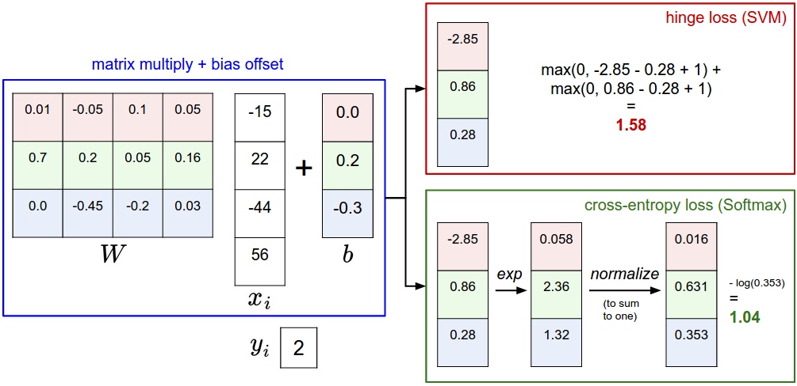

# Introduction

In the last section we introduced the problem of Image Classification, which is the task of assigning a single label to an image from a fixed set of categories. Morever, we described the k-Nearest Neighbor (kNN) classifier which labels images by comparing them to (annotated) images from the training set. As we saw, kNN has a number of disadvantages:

- The classifier must *remember* all of the training data and store it for future comparisons with the test data. This is space inefficient because datasets may easily be gigabytes in size.
- Classifying a test image is expensive since it requires a comparison to all training images.

We are now going to develop a more powerful approach to image classification that we will eventually naturally extend to entire Neural Networks and Convolutional Neural Networks. The approach will have two major components: a **score function** that maps the raw data to class scores, and a **loss function** that quantifies the agreement between the predicted scores and the ground truth labels. We will then cast this as an optimization problem in which we will minimize the loss function with respect to the parameters of the score function.

# Linear Classifier

## Architecture

**Linear classifier** for multi-class/binary class. In this module we will start out with arguably the simplest possible function, a linear mapping:
$$
f(x_i, W, b) =  W x_i + b
$$
In the above equation, we are assuming that the image $x_i$ has all of its pixels flattened out to a single column vector of shape [D x 1]. The matrix **W** (of size [K x D]), and the vector **b** (of size [K x 1]) are the **parameters** of the function. The output of the linear mapping is the scores for all classes. You can think every row of **W** (and one item of **b**) is a classifier for one of the classes. 

The parameters in **W** are often called the **weights**, and **b** is called the **bias vector** because it influences the output scores, but without interacting with the actual data $x_i$. However, you will often hear people use the terms *weights* and *parameters* interchangeably.

Note: Convolutional Neural Networks will map image pixels to scores exactly as shown above, but the mapping function $f$ will be more complex and will contain more parameters.

**Bias trick.** Before moving on we want to mention a common simplifying trick to representing the two parameters **W,b** as one. A commonly used trick is to combine the two sets of parameters into a single matrix that holds both of them by extending the vector $x_i$ with one additional dimension that always holds the constant $1$ - a default *bias dimension*. With the extra dimension, the new score function will simplify to a single matrix multiply:
$$
f(x_i, W) =  W x_i
$$
An advantage of this approach is that the training data is used to learn the parameters **W,b**, but once the learning is complete we can discard the entire training set and only keep the learned parameters. That is because a new test image can be simply forwarded through the function and classified based on the computed scores. And classifying the test image involves a single matrix multiplication and addition, which is significantly cheap computational cost.

**Intuitions about linear classifier:**

- **Weighted Activations**. Notice that a linear classifier computes the score of a class as a weighted sum of all of its pixel values across all 3 of its color channels. Depending on precisely what values we set for these weights, the function has the capacity to like or dislike (depending on the sign of each weight) certain colors at certain positions in the image.

  

- **Classification Decision Boundary is a linear plane**. Since the images are stretched into high-dimensional column vectors, we can interpret each image as a single point in this space. Analogously, the entire dataset is a (labeled) set of points. As we saw above, every row of $W$ is a classifier for one of the classes. The geometric interpretation of these numbers is that as we change one of the rows of $W$, the corresponding line in the pixel space will rotate in different directions. The biases $b$, on the other hand, allow our classifiers to translate the lines. 

  

- **Template Mathcing**. Another interpretation for the weights $W$ is that each row of it corresponds to a *template* (or sometimes also called a *prototype*) for one of the classes. The score of each class for an image is then obtained by comparing each template with the image using an *inner product* (or *dot product*) one by one to find the one that “fits” best. With this terminology, the linear classifier is doing template matching, where the templates are learned. Another way to think of it is that we are still effectively doing Nearest Neighbor, but instead of having thousands of training images we are only using a single image per class (although we will learn it, and it does not necessarily have to be one of the images in the training set), and we use the (negative) inner product as the distance instead of the L1 or L2 distance.

  

**Image data preprocessing.** As a quick note, in the examples above we used the raw pixel values (which range from [0…255]). In Machine Learning, it is a very common practice to always perform normalization of your input features (in the case of images, every pixel is thought of as a feature). In particular, it is important to **center your data** by subtracting the mean from every feature. In the case of images, this corresponds to computing a *mean image* across the training images and subtracting it from every image to get images where the pixels range from approximately [-127 … 127]. Further common preprocessing is to scale each input feature so that its values range from [-1, 1]. Of these, zero mean centering is arguably more important but we will have to wait for its justification until we understand the dynamics of gradient descent.

## Loss function

In the previous section we defined a function from the pixel values to class scores, which was parameterized by a set of weights $W$. Moreover, we saw that we don’t have control over the training data $( x_i, y_i )$  (it is fixed and given), but we do have control over these weights ($W$ and $b$ are learnable) and we want to set them so that the predicted class scores are consistent with the ground truth labels in the training data. 

We are going to measure our unhappiness with incorrect outcomes with a **loss function** (or sometimes also referred to as the **cost function** or the **objective function**). Intuitively, the loss will be high if we’re doing a poor job of classifying the training data, and it will be low if we’re doing well.

### SVM loss

There are several ways to define the details of the loss function. As a first example we will first develop a commonly used loss called the **Multiclass Support Vector Machine** (SVM) loss. The SVM loss is set up so that the SVM “wants” the correct class for each image to a have a score higher than the incorrect classes by some fixed margin $\Delta$. The linear classifier works with SVM loss is called **SVM classifier**.

Let’s now get more precise. Recall that for the i-th example we are given the pixels of image $x_i$ and the label $y_i$ that specifies the index of the correct class. The score function takes the pixels and computes the vector $f(x_i, W)$ of class scores, which we will abbreviate to $s_j=f(x_i, W)_j$ as the score for j-th class. The Multiclass SVM loss for the i-th example is then formalized as follows: 
$$
L(x_i, y_i) = \sum_{j \neq y_i} \max(0, s_j - s_{y_i} + \Delta)
$$
where $s_j=f(x_i, W)_j$ for our multiclass linear classifier is equal to $W_{j,:}x_i$.

In summary, the SVM loss function wants the score of the correct class $y_i$ to be larger than the incorrect class scores ($j \neq y_i$) by at least by $\Delta$. If this is not the case, we will accumulate loss.

The Multiclass Support Vector Machine "wants" the score of the correct class to be higher than all other scores by at least a margin of delta. If any class has a score inside the red region (or higher), then there will be accumulated loss. Otherwise the loss will be zero. Our objective will be to find the weights that will simultaneously satisfy this constraint for all examples in the training data and give a total loss that is as low as possible.

Note that the threshold at zero $max(0,-)$ function is often called the **hinge loss**. You’ll sometimes hear about people instead using the **squared hinge loss** SVM (or **L2-SVM**), which uses the form $max(0,-)^2$ that penalizes violated margins more strongly (quadratically instead of linearly). The unsquared version is more standard, but in some datasets the squared hinge loss can work better.

### Regularization

**Weights symmetry**. There is one bug with the loss function we presented above. Suppose that we have a dataset and a set of parameters **W** that correctly classify every example (i.e. all scores are so that all the margins are met). The issue is that this set of **W** is not necessarily unique: there might be many similar **W** that correctly classify the examples. For example, if **W** can correctly classify every example, then **2W**, **3W**, ... and so on can also correctly classify all examples, this transformation uniformly stretches all score magnitudes and hence also their absolute differences.

**Small weights preference**. In other words, we wish to encode some preference for a certain set of weights **W** over others to remove this ambiguity. We can do so by extending the loss function with a **regularization penalty**. The most common regularization penalty is the squared **L2** norm that discourages large weights through an elementwise quadratic penalty over all parameters:
$$
R(W)=\sum_{r,c} W_{r,c}^2
$$
Including the regularization penalty completes the full Multiclass Support Vector Machine loss, which is made up of two components: the **data loss** and the **regularization loss**:
$$
L =  \underbrace{ \frac{1}{N} \sum_i L_i }_\text{data loss} + \underbrace{ \lambda R(W) }_\text{regularization loss} \\\\
$$

**Small weights and generalization**. The most appealing property is that penalizing large weights tends to improve generalization, because it means that no input dimension can have a very large influence on the scores all by itself. Since the L2 penalty prefers smaller and more diffuse weight vectors, e.g. perfers $[0.25, 0.25, 0.25, 0.25]$ over $[1.0, 1.0, 1.0, 1.0]$, the final classifier is encouraged to take into account all input dimensions to small amounts rather than a few input dimensions and very strongly. As we will see later in the class, this effect can improve the generalization performance of the classifiers on test images and lead to less *overfitting*.

**Regularize biases**. Note that biases do not have the same effect since, unlike the weights, they do not control the strength of influence of an input dimension. Therefore, it is common to only regularize the weights $W$ but not the biases $b$. However, in practice this often turns out to have a negligible effect.

### Practical Considerations

**Setting Delta.** Note that we brushed over the hyperparameter $\Delta$ and its setting. What value should it be set to, and do we have to cross-validate it? It turns out that this hyperparameter can safely be set to $\Delta=1$ in all cases. The hyperparameters $\Delta$ and $\lambda$ seem like two different hyperparameters, but in fact they both control the same tradeoff: The tradeoff between the data loss and the regularization loss in the objective. The key to understanding this is that the magnitude of the weights $W$ has direct effect on the scores (and hence also their differences): As we shrink all values inside $W$ the score differences will become lower, and as we scale up the weights the score differences will all become higher. Therefore, the exact value of the margin between the scores (e.g. $\Delta=1$, or $\Delta=10$) is in some sense meaningless because the weights can shrink or stretch the differences arbitrarily.

**Relation to Binary Support Vector Machine**. You may be coming to this class with previous experience with Binary Support Vector Machines, where the loss for the i-th example can be written as:
$$
L_i = C \max(0, 1 - y_i w^Tx_i) + R(W)
$$
You can convince yourself that the formulation we presented in this section contains the binary SVM as a special case when there are only two classes. That is, if we only had two classes then the loss reduces to the binary SVM shown above.

**Optimization in original form**. If you’re coming to this class with previous knowledge of SVMs, you may have also heard of kernels, duals, the SMO algorithm, etc. In this class (as is the case with Neural Networks in general) we will always work with the optimization objectives in their unconstrained original form.

**Other Multiclass SVM formulations.** It is worth noting that the Multiclass SVM presented in this section is one of few ways of formulating the SVM over multiple classes. Another commonly used form is the *One-Vs-All* (OVA) SVM which trains an independent binary SVM for each class vs. all other classes. Related, but less common to see in practice is also the *All-vs-All* (AVA) strategy. Our formulation follows the [Weston and Watkins 1999 (pdf)](https://www.elen.ucl.ac.be/Proceedings/esann/esannpdf/es1999-461.pdf) version, which is a more powerful version than OVA (in the sense that you can construct multiclass datasets where this version can achieve zero data loss, but OVA cannot. See details in the paper if interested). The last formulation you may see is a *Structured SVM*, which maximizes the margin between the score of the correct class and the score of the highest-scoring incorrect runner-up class.

## Softmax Classifier

It turns out that the SVM is one of two commonly seen classifiers. The other popular choice is the **Softmax classifier**, which has a different loss function. If you’ve heard of the binary Logistic Regression classifier before, the Softmax classifier is its generalization to multiple classes. 

In the Softmax classifier, the function mapping $f(x_i, W)=Wx_i$ stays unchanged, but we now interpret these scores as the unnormalized log probabilities for each class and replace the **hinge loss** with a **cross-entropy loss**.

### Probabilistic output

Using the **softmax function** to take a vector of arbitrary real-valued scores and squashes it to a vector of values between zero and one that sum to one:
$$
P(y_i|x_i,W)=\frac {\exp(s_{y_i})} {\sum_j \exp(s_j)}
$$
where $s_j = f(x_i, W)_j$ and $s_{y_i}=f(x_i, W)_{y_i}$.

Remember that the Softmax classifier interprets the scores inside the output vector $f(x_i, W)$ as the unnormalized log probabilities. Exponentiating these quantities therefore gives the (unnormalized) probabilities, and the division performs the normalization so that the probabilities sum to one.

**Practical issues: Numeric stability**. When you’re writing code for computing the Softmax function in practice, the intermediate terms $\exp(s_j)$ and $\sum \exp(s_j)$ may be very large due to the exponentials. Dividing large numbers can be numerically unstable, so it is important to use a normalization trick. Softmax has a property: if we add a constant $C$ for all of $s_j$, the output of softmax is unchanged. So we can add $\max_j s_j$ for all of $s_j$ to solve the numeric instability issue.

### Cross-entropy loss

**Information theory view**. The *cross-entropy* between a “true” distribution $p$ and an estimated distribution $q$ is defined as:
$$
H(p, q) = -\sum_{x} p(x) {\log q(x)}
$$
The Softmax classifier is hence minimizing the cross-entropy between the estimated class probabilities $q=P(y_i|x_i, W)$ and the “true” distribution, which in this interpretation is the distribution where all probability mass is on the correct class (i.e. $p = [0, \ldots 1, \ldots, 0]$ contains a single 1 at the $y_i$ -th position). Then we get the loss for Softmax classifier as following:
$$
L(x_i, y_i) = -\sum_j I(j=y_i) \log P(j|x_i, W) = -\log P(y_i|x_i,W)
$$
where $I()$ is an indicator function.

Moreover, since the cross-entropy can be written in terms of entropy and the Kullback-Leibler divergence as $H(p,q) = H(p) + D_{KL}(p||q)$, and the entropy of the $p$ is irrelated, this is also equivalent to minimizing the KL divergence between the two distributions (a measure of distance). In other words, the cross-entropy objective *wants* the predicted distribution to have all of its mass on the correct answer.

**Probabilistic view**. According the above loss function, we are actually minimizing the negative log likelihood of the correct class, which can be interpreted as performing **Maximum Likelihood Estimation** (MLE). A nice feature of this view is that we can now also interpret the regularization term $R(W)$ in the full loss function as coming from a Gaussian prior over the weight matrix $W$, where instead of MLE we are performing the **Maximum a posteriori estimation** (MAP).

### SVM vs. Softmax

**Softmax classifier provides “probabilities” for each class.** Unlike the SVM which computes uncalibrated and not easy to interpret scores for all classes, the Softmax classifier allows us to compute “probabilities” for all labels. For example, given an image the SVM classifier might give you scores [12.5, 0.6, -23.0] for the classes “cat”, “dog” and “ship”. The softmax classifier can instead compute the probabilities of the three labels as [0.9, 0.09, 0.01], which allows you to interpret its confidence in each class. 

The reason we put the word “probabilities” in quotes, however, is that how peaky or diffuse these probabilities are depends directly on the regularization strength $\lambda$ which you are in charge of as input to the system. For example, suppose that the unnormalized log-probabilities for some three classes come out to be [1, -2, 0]. The softmax function would then compute:
$$
[1, -2, 0] \rightarrow [e^1, e^{-2}, e^0] = [2.71, 0.14, 1] \rightarrow [0.7, 0.04, 0.26]
$$
Where the steps taken are to exponentiate and normalize to sum to one. Now, if the regularization strength $\lambda$ was higher, the weights $W$ would be penalized more and this would lead to smaller weights. For example, suppose that the weights became one half smaller ([0.5, -1, 0]). The softmax would now compute:
$$
[0.5, -1, 0] \rightarrow [e^{0.5}, e^{-1}, e^0] = [1.65, 0.37, 1] \rightarrow [0.55, 0.12, 0.33]
$$
where the probabilites are now more diffuse. Moreover, in the limit where the weights go towards tiny numbers due to very strong regularization strength $\lambda$, the output probabilities would be near uniform. Hence, the probabilities computed by the Softmax classifier are better thought of as confidences where, similar to the SVM, the ordering of the scores is interpretable, but the absolute numbers (or their differences) technically are not.

**In practice, SVM and Softmax are usually comparable.** The performance difference between the SVM and Softmax are usually very small, and different people will have different opinions on which classifier works better. Compared to the Softmax classifier, the SVM is a more *local* objective, which could be thought of either as a bug or a feature. Consider an example that achieves the scores [10, -2, 3] and where the first class is correct. An SVM (e.g. with desired margin of $\Delta = 1$) will see that the correct class already has a score higher than the margin compared to the other classes and it will compute loss of zero. The SVM does not care about the details of the individual scores: if they were instead [10, -100, -100] or [10, 9, 9] the SVM would be indifferent since the margin of 1 is satisfied and hence the loss is zero. However, these scenarios are not equivalent to a Softmax classifier, which would accumulate a much higher loss for the scores [10, 9, 9] than for [10, -100, -100]. In other words, the Softmax classifier is never fully happy with the scores it produces: the correct class could always have a higher probability and the incorrect classes always a lower probability and the loss would always get better. However, the SVM is happy once the margins are satisfied and it does not micromanage the exact scores beyond this constraint.

# Further Reading

These readings are optional and contain pointers of interest.

- [Deep Learning using Linear Support Vector Machines](https://arxiv.org/abs/1306.0239) from Charlie Tang 2013 presents some results claiming that the L2SVM outperforms Softmax.