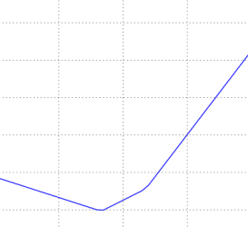

# Introduction

In the previous section we introduced two key components in context of the image classification task:

1. A (parameterized) **score function** mapping the raw image pixels to class scores (e.g. a linear function)
2. A **loss function** that measured the quality of a particular set of parameters based on how well the induced scores agreed with the ground truth labels in the training data. We saw that there are many ways and versions of this (e.g. Softmax/SVM).

We are now going to introduce the third and last key component: **optimization**. Optimization is the process of finding the set of parameters $W$ that minimize the loss function.

Note: Once we understand how these three core components interact, we will revisit the first component (the parameterized function mapping) and extend it to functions much more complicated than a linear mapping: First entire Neural Networks, and then Convolutional Neural Networks. The loss functions and the optimization process will remain relatively unchanged.

## Visualizing the loss function

We'll take SVM loss as example:
$$
L = \frac{1}{N} \sum_i \sum_{j\neq y_i} \left[ \max(0, f(x_i; W)_j - f(x_i; W)_{y_i} + 1) \right] + \alpha R(W)
$$
The loss functions we’ll look at in this class are usually defined over very high-dimensional spaces, making them difficult to visualize. However, we can still gain some intuitions about one by slicing through the high-dimensional space along rays (1 dimension), or along planes (2 dimensions). 

For example, we can generate a random weight matrix $W$ (which corresponds to a single point in the space), then march along a ray (1 dimension) and record the loss function value along the way. That is, we can generate a random direction $W1$ and compute the loss along this direction by evaluating $L(W+aW1)$ for different values of $a$:



This process generates a simple plot with the value of $a$ as the x-axis and the value of the loss function as the y-axis. We can also carry out the same procedure with 2 dimensions by evaluating the loss $L(W+aW1+bW2)$ as we vary $a,b$. In a plot, $a,b$ could then correspond to the x-axis and the y-axis, and the value of the loss function can be visualized with a color:


Notice SVM loss with the piecewise-linear structure and has a bowl shape. As an aside, you may have guessed from its bowl-shaped appearance that the SVM cost function is an example of a [convex function](http://en.wikipedia.org/wiki/Convex_function) There is a large amount of literature devoted to efficiently minimizing these types of functions, and you can also take a Stanford class on the topic ( [convex optimization](http://stanford.edu/~boyd/cvxbook/) ). Once we extend our score functions ff to Neural Networks our objective functions will become non-convex, and the visualizations above will not feature bowls but complex, bumpy terrains.

*Non-differentiable loss functions*. As a technical note, you can also see that the *kinks* in the loss function (due to the max operation) technically make the loss function non-differentiable because at these kinks the gradient is not defined. However, the [subgradient](http://en.wikipedia.org/wiki/Subderivative) still exists and is commonly used instead. In this class will use the terms *subgradient* and *gradient* interchangeably.

# Optimization

To reiterate, the loss function lets us quantify the quality of any particular set of weights **W**. The goal of optimization is to find **W** that minimizes the loss function. We will now motivate and slowly develop an approach to optimizing the loss function.

## Strategy #1: Random Search

Since it is so simple to check how good a given set of parameters **W** is, the first (very bad) idea that may come to mind is to simply try out many different random weights and keep track of what works best:

```python
bestloss = float("inf") # Python assigns the highest possible float value
for num in xrange(1000):
  W = np.random.randn(10, 3073) * 0.0001 # generate random parameters
  loss = L(X_train, Y_train, W) # get the loss over the entire training set
  if loss < bestloss: # keep track of the best solution
    bestloss = loss
    bestW = W
  print 'in attempt %d the loss was %f, best %f' % (num, loss, bestloss)
```

Then we can take the best weights **W** found by this search and try it out on the test set:

```python
# Assume X_test is [3073 x 10000], Y_test [10000 x 1]
scores = Wbest.dot(Xte_cols) # 10 x 10000, the class scores for all test examples
# find the index with max score in each column (the predicted class)
Yte_predict = np.argmax(scores, axis = 0)
# and calculate accuracy (fraction of predictions that are correct)
np.mean(Yte_predict == Yte)
# returns 0.1555
```

This strategy is better than random guess. But there is a obvious issue with our random search strategy: each time we guess a new random weights that don't use search information got in the previous time.

**Core idea: iterative refinement**. Of course, it turns out that we can do much better. The core idea is that finding the best set of weights **W** is a very difficult or even impossible problem (especially once **W**contains weights for entire complex neural networks), but the problem of refining a specific set of weights **W** to be slightly better is significantly less difficult. In other words, our approach will be to start with a random **W** and then iteratively refine it, making it slightly better each time.

## Strategy #2: Random Local Search

A better strategy you may think of is to try to extend one foot in a **random direction** and then take a step only if it leads downhill. Concretely, we will start out with a random $W$, generate random perturbations $\Delta W$ to it and if the loss at the perturbed $W + \Delta W$ is lower, we will perform an update:

```python
W = np.random.randn(10, 3073) * 0.001 # generate random starting W
bestloss = float("inf")
for i in xrange(1000):
  step_size = 0.0001 # control the delta of weights
  Wtry = W + np.random.randn(10, 3073) * step_size
  loss = L(Xtr_cols, Ytr, Wtry)
  if loss < bestloss:
    W = Wtry
    bestloss = loss
  print 'iter %d loss is %f' % (i, bestloss)
```

This is better, but still wasteful and computationally expensive. We'll find a better way to get the downhill direction in the next section.

## Strategy #3: Following the Gradient

In the previous section we tried to find a direction in the weight-space that would improve our weight vector (and give us a lower loss). It turns out that there is no need to randomly search for a good direction: we can compute the *best* direction along which we should change our weight vector that is mathematically guaranteed to be the direction of the steepest descend (at least in the limit as the step size goes towards zero). This direction will be related to the **gradient** of the loss function.

In one-dimensional functions, the slope (more commonly referred to as **derivatives**) is the instantaneous rate of change of the function at any point you might be interested in. The **gradient** is a generalization of slope for functions that don’t take a single number but a vector of numbers. Additionally, the gradient is just a vector of  **derivatives** for each dimension in the input space. When the functions of interest take a vector of numbers instead of a single number, we call the derivatives **partial derivatives**, and the gradient is simply the vector of partial derivatives in each dimension.

### Gradient Descent

We should repeatedly compute the gradient of the loss function and then performing a parameter update in negative gradient direction. This is called *Gradient Descent*. Its **vanilla** version looks as follows:

```python
# Vanilla Gradient Descent

while True:
  weights_grad = evaluate_gradient(loss_fun, data, weights)
  weights += - step_size * weights_grad # perform parameter update
```

This simple loop is at the core of all Neural Network libraries. There are other ways of performing the optimization (e.g. LBFGS), but Gradient Descent is currently by far the most common and established way of optimizing Neural Network loss functions.

**Mini-batch gradient descent.** In large-scale applications (such as the ILSVRC challenge), the training data can have on order of millions of examples. Hence, it seems wasteful to compute the full loss function over the entire training set in order to perform only a single parameter update. A very common approach to addressing this challenge is to compute the gradient over **batches** of the training data. The batch's gradient  is used to perform a parameter update:

```python
# Vanilla Minibatch Gradient Descent

while True:
  data_batch = sample_training_data(data, 256) # sample 256 examples
  weights_grad = evaluate_gradient(loss_fun, data_batch, weights)
  weights += - step_size * weights_grad # perform parameter update
```

The reason this works well is that the examples in the training data are correlated. Thus the gradient from a mini-batch is a good approximation of the gradient of the full objective. Therefore, much faster convergence can be achieved in practice by evaluating the mini-batch gradients to perform more frequent parameter updates.

**Stochastic gradient descent**. The extreme case of this is a setting where the mini-batch contains only a single example. This process is also called **on-line gradient descent**. This is relatively less common to see because in practice due to vectorized code optimizations it can be computationally much more efficient to evaluate the gradient for 100 examples, than the gradient for one example 100 times. Even though SGD technically refers to using a single example at a time to evaluate the gradient, you will hear people use the term SGD even when referring to mini-batch gradient descent, where it is usually assumed that mini-batches are used.

**Hyper-parameters**:

- The **batch size** is a hyperparameter but it is not very common to cross-validate it. It is usually based on memory constraints (if any), or set to some value, e.g. 32, 64 or 128. We use powers of 2 in practice because many vectorized operation implementations work faster when their inputs are sized in powers of 2.

- The gradient tells us the direction in which the function has the steepest rate of increase, but it does not tell us how far along this direction we should step. As we will see later in the course, choosing the **step size** (also called the **learning rate**) will become one of the most important (and most headache-inducing) hyperparameter settings in training a neural network: if it is too low the progress is steady but slow. If it is too high the progress can be faster, but more risky.

### Computing the Gradient

There are two ways to compute the gradient: A slow, approximate but easy way (**numerical gradient**), and a fast, exact but more error-prone way that requires calculus (**analytic gradient**).

#### Computing the gradient numerically with finite differences

$$
\frac{df(x)}{dx} = \lim_{h\ \to 0} \frac{f(x + h) - f(x)}{h}
$$

**A problem of efficiency**. You may have noticed that evaluating the numerical gradient has complexity linear in the number of parameters. In our example we had 30730 parameters in total and therefore had to perform 30,731 evaluations of the loss function to evaluate the gradient and to perform only a single parameter update. This problem only gets worse, since modern Neural Networks can easily have tens of millions of parameters. Clearly, this strategy is not scalable and we need something better.

#### Computing the gradient analytically with Calculus

The numerical gradient is very simple to compute using the finite difference approximation, but the downside is that it is approximate, and that it is very computationally expensive to compute. The second way to compute the gradient is analytically using Calculus, which allows us to derive a direct formula for the gradient (no approximations) that is also very fast to compute.

However, unlike the numerical gradient it can be more error prone to implement, which is why in practice it is very common to compute the analytic gradient and compare it to the numerical gradient to check the correctness of your implementation. This is called a **gradient check**.

Lets use the example of the SVM loss function for a single data point:
$$
L_i = \sum_{j\neq y_i} \left[ \max(0, w_j^Tx_i - w_{y_i}^Tx_i + \Delta) \right]
$$
For example, taking the gradient with respect to $w_{y_i}$:
$$
\nabla_{w_{y_i}} L_i = - \left( \sum_{j\neq y_i} \mathbb{1}(w_j^Tx_i - w_{y_i}^Tx_i + \Delta > 0) \right) x_i
$$
Notice that the above is the gradient only with respect to the row of $W$ that corresponds to the correct class. For the other rows where $j \neq y_i$ the gradient is:
$$
\nabla_{w_j} L_i = \mathbb{1}(w_j^Tx_i - w_{y_i}^Tx_i + \Delta > 0) x_i
$$
In the next section we will develop proficiency in computing the gradient analytically using the chain rule, otherwise also referred to as **backpropagation**. This will allow us to efficiently optimize relatively arbitrary loss functions that express all kinds of Neural Networks, including Convolutional Neural Networks.

# Summary


Summary of the information flow. The dataset of pairs of **(x,y)** is given and fixed. The weights start out as random numbers and can change. During the forward pass the score function computes class scores, stored in vector **f**. The loss function contains two components: The data loss computes the compatibility between the scores **f** and the labels **y**. The regularization loss is only a function of the weights. During Gradient Descent, we compute the gradient on the weights (and optionally on data if we wish) and use them to perform a parameter update during Gradient Descent.