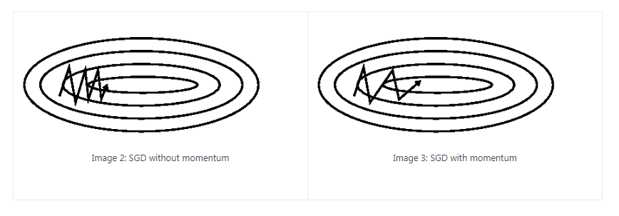
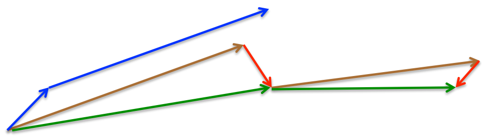

[TOC]


# Introduction

Gradient descent is one of the most popular algorithms to perform optimization and by far the most common way to optimize neural networks. At the same time, every state-of-the-art Deep Learning library contains implementations of various algorithms to optimize gradient descent. These algorithms, however, are often used as black-box optimizers, as practical explanations of their strengths and weaknesses are hard to come by. This blog [post](http://ruder.io/optimizing-gradient-descent/) aims at providing you with intuitions towards the behaviour of different algorithms for optimizing gradient descent that will help you put them to use. 

We are first going to look at the different variants of gradient descent. We will then briefly summarize challenges during training. Subsequently, we will introduce the most common optimization algorithms by showing their motivation to resolve these challenges and how this leads to the derivation of their update rules. We will also take a short look at algorithms and architectures to optimize gradient descent in a parallel and distributed setting. Finally, we will consider additional strategies that are helpful for optimizing gradient descent.

# Gradient descent variants

Gradient descent is a way to minimize an objective function $J(\theta)$ parameterized by a model's parameters $\theta \in \mathbb{R}^d$ by updating the parameters in the opposite direction of the gradient of the objective function $\nabla_\theta J(\theta)$ w.r.t. to the parameters. The learning rate $\eta$ determines the size of the steps we take to reach a (local) minimum. In other words, we follow the direction of the slope of the surface created by the objective function downhill until we reach a valley.

There are three variants of gradient descent, which differ in how much data we use to compute the gradient of the objective function. *Depending on the amount of data, we make a trade-off between the accuracy of the parameter update and the time it takes to perform an update*.

## Batch gradient descent

Vanilla gradient descent, aka batch gradient descent, computes the gradient of the cost function w.r.t. to the parameters $\theta$ for the entire training dataset:
$$
\theta = \theta - \eta \cdot \nabla_\theta J( \theta)
$$
As we need to calculate the gradients for the whole dataset to perform just *one* update, batch gradient descent can be very slow and is intractable for datasets that don't fit in memory. Batch gradient descent also doesn't allow us to update our model *online*, i.e. with new examples on-the-fly.

The pseudo-code of batch gradient descent as follows:

```python
for epoch in range(num_epochs):
    # calculate the gradient of the cost function w.r.t to the model parameters
    params_grad = evaluate_gradient(loss_function, dataset, params)
    # update the model parameters
    params = params - learning_rate * params_grad
```

Note that state-of-the-art deep learning libraries provide automatic differentiation that efficiently computes the gradient w.r.t. some parameters. If you derive the gradients yourself, then gradient checking is a good idea.

We then update our parameters in the opposite direction of the gradients with the learning rate determining how big of an update we perform. Batch gradient descent is guaranteed to converge to the global minimum for convex error surfaces and to a local minimum for non-convex surfaces.

## Stochastic gradient descent

Stochastic gradient descent (SGD) in contrast performs a parameter update for *each* training example $(x^{(i)}, y^{(i)})$:
$$
\theta = \theta - \eta \cdot \nabla_\theta J( \theta; x^{(i)}; y^{(i)})
$$
Batch gradient descent performs redundant computations for large datasets, as it recomputes gradients for similar examples before each parameter update. SGD does away with this redundancy by performing one update at a time. It is therefore usually much faster and can also be used to learn online.

The pseudo-code of stochastic gradient descent as follows:

```python
for epoch in range(num_epochs):
    # Note that we shuffle the training data at every epoch
    shuffle(dataset)
    # for-each training examples
    for x, y in dataset:
        params_grad = evaluate_gradient(loss_function, x, y, params)
        params = params - learning_rate * params_grad
```

SGD performs frequent updates with a high variance that cause the objective function to fluctuate heavily (From [Wikipedia](https://upload.wikimedia.org/wikipedia/commons/f/f3/Stogra.png)):


While batch gradient descent converges to the minimum of the basin the parameters are placed in, SGD's fluctuation, on the one hand, enables it to jump to new and potentially better local minima. On the other hand, this ultimately complicates convergence to the exact minimum, as SGD will keep overshooting. However, it has been shown that when we slowly decrease the learning rate, SGD shows the same convergence behaviour as batch gradient descent, almost certainly converging to a local or the global minimum for non-convex and convex optimization respectively.

## Mini-batch gradient descent

Mini-batch gradient descent finally takes the best of both worlds and performs an update for every mini-batch of $n$ training examples:
$$
\theta = \theta - \eta \cdot \nabla_\theta J( \theta; x^{(i:i+n)}; y^{(i:i+n)})
$$
This way, it *a)* reduces the variance of the parameter updates, which can lead to more stable convergence; and *b)* can make use of highly optimized matrix optimizations common to state-of-the-art deep learning libraries that make computing the gradient w.r.t. a mini-batch very efficient.

The pseudo-code of mini-batch gradient descent as follows:

```python
for epoch in range(num_epochs):
    # Note that we shuffle the training data at every epoch
    shuffle(dataset)
    # for-each training examples
    for batch in get_batches(dataset, batch_size=25):
        params_grad = evaluate_gradient(loss_function, batch, params)
        params = params - learning_rate * params_grad
```

The size of mini-batch is a hyper-parameter. Common mini-batch sizes range between 50 and 256, but can vary for different applications. Mini-batch gradient descent is typically the algorithm of choice when training a neural network and the term SGD usually is employed also when mini-batches are used.

# Challenges of gradient descent

Vanilla mini-batch gradient descent, however, does not guarantee good convergence, but offers a few challenges that need to be addressed:

- Choosing a proper learning rate can be difficult. A learning rate that is too small leads to painfully slow convergence, while a learning rate that is too large can hinder convergence and cause the loss function to fluctuate around the minimum or even to diverge.
- Learning rate schedules try to adjust the learning rate during training by e.g. annealing, i.e. reducing the learning rate according to a pre-defined schedule or when the change in objective between epochs falls below a threshold. These schedules and thresholds, however, have to be defined in advance and are thus unable to adapt to a dataset's characteristics.
- Additionally, the same learning rate applies to all parameter updates. If our data is sparse and our features have very different frequencies, we might not want to update all of them to the same extent, but perform a larger update for rarely occurring features.
- Another key challenge of minimizing highly non-convex error functions common for neural networks is avoiding getting trapped in their numerous suboptimal local minima. Dauphin et al. argue that the difficulty arises in fact not from local minima but from saddle points, i.e. points where one dimension slopes up and another slopes down. These saddle points are usually surrounded by a plateau of the same error, which makes it notoriously hard for SGD to escape, as the gradient is close to zero in all dimensions.

# Gradient descent optimization algorithms

In the following, we will outline some algorithms that are widely used by the deep learning community to deal with the aforementioned challenges. We will not discuss algorithms that are infeasible to compute in practice for high-dimensional data sets, e.g. second-order methods such as [Newton's method](https://en.wikipedia.org/wiki/Newton%27s_method_in_optimization).

## Momentum

SGD has trouble navigating ravines, i.e. areas where the surface curves much more steeply in one dimension than in another, which are common around local optima. In these scenarios, SGD oscillates across the slopes of the ravine while only making hesitant progress along the bottom towards the local optimum.



Momentum is a method that helps accelerate SGD in the relevant direction and dampens oscillations. It does this by adding a fraction $\gamma$ of the update vector of the past time step to the current update vector:
$$
\begin{split} 
v_t &= \gamma v_{t-1} + \eta \nabla_\theta J( \theta) \\ 
\theta &= \theta - v_t 
\end{split}
$$
Note: Some implementations exchange the signs in the equations. The momentum term $\gamma$ is usually set to 0.9 or a similar value.

You can consider $\gamma  v_{t-1}$ as a term to accumulate gradients of the past time. So we can arrange the updating rule as following:
$$
\theta = \theta - (\eta \nabla_\theta J( \theta) + \nabla_\theta J( \theta)_\text{acc})
$$
Essentially, when using momentum, we push a ball down a hill. The ball accumulates momentum as it rolls downhill, becoming faster and faster on the way (until it reaches its terminal velocity if there is air resistance, i.e. $\gamma < 1$). The same thing happens to our parameter updates: The momentum term increases for dimensions whose gradients point in the same directions and reduces updates for dimensions whose gradients change directions. As a result, we gain faster convergence and reduced oscillation.

## Nesterov accelerated gradient

However, a ball that rolls down a hill, blindly following the slope, is highly unsatisfactory. We'd like to have a smarter ball, a ball that has a notion of where it is going so that it knows to slow down before the hill slopes up again. Nesterov accelerated gradient (NAG) is a way to give our momentum term this kind of prescience.

In NAG, we want to estimate the future position of our parameters first. How can we do this? We take the  $\gamma v_{t-1}$, i.e. accumulated gradient, as the approximation of current gradient to move the parameters $\theta$. We can now get an approximation of the next position of the parameters by computing $\theta_\text{next} = \theta - \gamma v_{t-1}$, a rough idea where our parameters are going to be.

Then we can now effectively look ahead by calculating the gradient not w.r.t. to our current parameters $\theta$ but w.r.t. the approximate future position $\theta_\text{next}$ of our parameters:
$$
\eta \nabla_\theta J( \theta_\text{next})
$$
Put those ideas into the Momentum optimization method, we get NAG:
$$
\begin{split}
v_t &= \gamma v_{t-1} + \eta \nabla_\theta J( \theta_\text{next}) \\
\theta &= \theta - v_t
\end {split}
$$
Again, we set the momentum term $\gamma$ to a value of around 0.9. 

The difference between Momentum and NAG: While Momentum first computes the current gradient (small blue vector in following image) and then takes a big jump in the direction of the updated accumulated gradient (big blue vector), NAG first makes a big jump in the direction of the previous accumulated gradient (brown vector), measures the gradient and then makes a correction (red vector), which results in the complete NAG update (green vector). This look-ahead update prevents us from going too fast and results in increased responsiveness, which has significantly increased the performance of RNNs on a number of tasks ([Advances in Optimizing Recurrent Networks](http://arxiv.org/abs/1212.0901)).



The image from  [G. Hinton's lecture 6c](http://www.cs.toronto.edu/~tijmen/csc321/slides/lecture_slides_lec6.pdf). Refer to [here](http://cs231n.github.io/neural-networks-3/) for another explanation about the intuitions behind NAG, while Ilya Sutskever gives a more detailed overview in his PhD thesis.

## Adagrad

Now that we are able to adapt our updates to the slope of our error function and speed up SGD in turn, we would also like to adapt our updates to each individual parameter to perform larger or smaller updates depending on their importance (we might want to perform a larger update for parameters related to the rarely occurring features).

Adagrad is an algorithm for gradient-based optimization that does just this: It adapts the learning rate to the parameters, performing smaller updates (i.e. low learning rates) for parameters associated with frequently occurring features, and larger updates (i.e. high learning rates) for parameters associated with infrequent features. For this reason, *it is well-suited for dealing with sparse data*.

Dean et al. have found that Adagrad greatly improved the robustness of SGD. Moreover, Pennington et al.  used Adagrad to train GloVe word embeddings, as infrequent words require much larger updates than frequent ones.

Previously, we performed an update for all parameters $\theta$ at once as every parameter $\theta_i$ used the same learning rate $\eta$. As Adagrad uses a different learning rate for every parameter $\theta_i$ at every time step $t$, we first show Adagrad's per-parameter update. For brevity, we use $g^{(t)}$ to denote the gradient at time step $t$. $g^{(t)}_i = \nabla_\theta J( \theta^{(t)}_i )$ is then the partial derivative of the objective function w.r.t. to the parameter $\theta_i$ at time step $t$. Adagrad modifies the general learning rate $\eta$ of SGD at each time step $t$ for every parameter $\theta_i$ based on the past gradients that have been computed for $\theta_i$:
$$
\eta_i = \frac{\eta}{\sqrt{G^{(t)}_{i,i} + \epsilon}}
$$
where $G^{(t)} \in \mathbb{R}^{d \times d}$ is a diagonal matrix where each diagonal element $G_{i,i}=\sum_{t'}^{t} (g^{t'}_i)^2$ is the sum of the squares of the gradients w.r.t. $\theta_i$ up to time step $t$. It's obviously that the larger $G_{i,i}$ is, and the slower $\theta_i$ changed; and $\epsilon$ is a smoothing term that avoids division by zero (usually on the order of $1e-8$); Interestingly, without the square root operation, the algorithm performs much worse. One of Adagrad's main benefits is that it eliminates the need to manually tune the learning rate $\eta$. Most implementations use a default value of $\eta = 0.01$ and leave it at that. 

Now the parameters updating rule as follows:
$$
\theta^{(t+1)}_i = \theta^{(t)}_i - \eta_i \cdot g^{(t)}_i
$$
As $G^{(t)}$ contains the sum of the squares of the past gradients w.r.t. to all parameters $\theta$ along its diagonal, we can now vectorize our implementation:
$$
\theta^{(t+1)} = \theta^{(t)} - \dfrac{\eta}{\sqrt{G^{(t)} + \epsilon}}  g^{(t)}
$$
Adagrad's main weakness is its accumulation of the squared gradients in the denominator: Since every added term is positive, the accumulated sum keeps growing during training. This in turn causes the learning rate to shrink and eventually become infinitesimally small, at which point the algorithm is no longer able to acquire additional knowledge. The following algorithms aim to resolve this flaw.

## Adadelta

Adadelta is an extension of Adagrad that seeks to reduce its aggressive, monotonically decreasing learning rate. Instead of accumulating all past squared gradients, Adadelta restricts the window of accumulated past gradients to some fixed size $w$.

How to record the $w$ past gradients? Instead of inefficiently storing $w$ previous squared gradients, the sum of gradients is recursively defined as a decaying average of all past squared gradients. The running average $E[g^2]^{(t+1)}$ at time step $t+1$ then depends only on the previous average and the current squared gradient $(g^2)^{(t+1)}$:
$$
E[g^2]^{(t+1)} = \gamma E[g^2]^{(t)} + (1 - \gamma)(g^{(t+1)})^2
$$
where $1 - \gamma$ controls how much of current gradient will be accumulated into the running average; we set $\gamma$ around 0.9. $E[g^2]^{(t)}$ is a vector with the same dimensions. The term $E[g^2]^{(t)}$ is the exponentially decaying average of squared gradients: in stark contrast to AdaGrad, we keep adding new information from squared gradients $(g^2)^{(t)}$, but we also make sure to decrease the effect of old gradients.

We can now simply replace the diagonal matrix $G^{(t)}$ in the Adagrad with the decaying average over past squared gradients $E[g^2]^{(t)}$. Then the parameters updating rule is:
$$
\begin{align} 
\begin{split} 
\theta^{(t+1)} &= \theta^{(t)} + \Delta \theta^{(t)} \\
\Delta \theta_t &= - \dfrac{\eta}{\sqrt{E[g^2]^{(t)} + \epsilon}} \odot  g^{(t)} = - \dfrac{\eta}{\text{RMS}[g]^{(t)}} \odot  g^{(t)}
\end{split} 
\end{align}
$$
where $\odot$ is a element-wise vector multiplication; $\text{RMS}[\cdot]$ denotes the root mean square metric.

The authors note that the units in this update (as well as in SGD, Momentum, or Adagrad) do not match, i.e. the update should have the same hypothetical units as the parameter. To realize this, they first define another exponentially decaying average $E[\Delta \theta^2]^{(t)}$'s RMS $\text{RMS}[\Delta \theta]^{(t)}$ to substitute the above learning rate $\eta$, this time not of squared gradients but of squared parameter updates:
$$
E[\Delta \theta^2]^{(t)} = \rho E[\Delta \theta^2]^{(t-1)} + (1 - \rho) (\Delta \theta^{(t)})^2
$$
Since $\text{RMS}[\Delta \theta]^{(t)}=\sqrt{E[\Delta \theta^2]^{(t)}}$ is unknown in time step $t$, we approximate it with the RMS of parameter updates until the previous time step $\text{RMS}[\Delta \theta]^{(t-1)}$. Then, AdaDelta becomes:
$$
\begin{align} 
\begin{split} 
\theta^{(t+1)} &= \theta^{(t)} + \Delta \theta^{(t)} \\
\Delta \theta^{(t)} &= - \dfrac{\text{RMS}[\Delta \theta]^{(t-1)}}{\text{RMS}[g]^{(t)}} \odot  g^{(t)}
\end{split}
\end{align}
$$
With Adadelta, we do not even need to set a default learning rate $\eta$, as it has been eliminated from the update rule.

## RMSprop

RMSprop is an unpublished, adaptive learning rate method proposed by Geoff Hinton in [Lecture 6e of his Coursera Class](http://www.cs.toronto.edu/~tijmen/csc321/slides/lecture_slides_lec6.pdf).

RMSprop and Adadelta have both been developed independently around the same time stemming from the need to resolve Adagrad's radically diminishing learning rates. RMSprop in fact is identical to the first update vector of Adadelta that we derived above:
$$
\begin{align} 
\begin{split} 
\theta^{(t+1)} &= \theta^{(t)} + \Delta \theta^{(t)} \\
\Delta \theta^{(t)} &= - \dfrac{\eta}{\sqrt{E[g^2]^{(t)} + \epsilon}} \odot  g^{(t)} \\
E[g^2]^{(t)} &= \gamma E[g^2]^{(t-1)} + (1-\gamma) (g^{(t)})^2
\end{split} 
\end{align}
$$
RMSprop as well divides the learning rate by an exponentially decaying average of squared gradients. Hinton suggests $\gamma$ to be set to 0.9, while a good default value for the learning rate $\eta$ is 0.001.

## Adam

Adaptive Moment Estimation (Adam) is another method that computes adaptive learning rates for each parameter. In addition to storing an exponentially decaying average of past squared gradients ($v^{(t)}$ in the following formulation) like Adadelta and RMSprop, Adam also keeps an exponentially decaying average of past gradients ($m^{(t)}$ in the following), similar to momentum. Whereas momentum can be seen as a ball running down a slope, Adam behaves like a heavy ball with friction, which thus prefers flat minima in the error surface.

We compute the decaying averages of past and past squared gradients $m^{(t)}$ and $v^{(t)}$ respectively as follows:
$$
m^{(t)} = \beta_1 m^{(t-1)} + (1 - \beta_1)g^{(t)} \\
v^{(t)} = \beta_2 v^{(t-1)} + (1 - \beta_2)(g^{(t)})^2
$$
$m^{(t)}$ and $v^{(t)}$ are estimates of the first moment (the mean) and the second moment (the uncentered variance) of the gradients respectively, hence the name of the method.

Then the parameters updating rule as follows:
$$
\theta^{(t+1)} = \theta^{(t)} - \frac {\eta} {\sqrt{{v}^{(t)}} + \epsilon} \odot {m}^{(t)}
$$
But as $m^{(t)}$ and $v^{(t)}$ are initialized as vectors of 0's, the authors of Adam observe that they are biased towards zero, especially during the initial time steps, and especially when the decay rates are small (i.e. $\beta_1$ and $\beta_2$ are close to 1). They counteract these biases by computing bias-corrected first and second moment estimates:
$$
\begin{align} 
\begin{split} 
\hat{m}^{(t)} &= \dfrac{{m}^{(t)}}{1 - \beta^t_1} \\ 
\hat{v}^{(t)} &= \dfrac{{v}^{(t)}}{1 - \beta^t_2} \end{split} 
\end{align}
$$
They then use these to update the parameters just as we have seen in Adadelta and RMSprop, which yields the Adam update rule:
$$
\theta^{(t+1)} = \theta^{(t)} - \frac {\eta} {\sqrt{\hat{v}^{(t)}} + \epsilon} \odot \hat{m}^{(t)}
$$
The authors propose default values of 0.9 for $\beta_1$, 0.999 for $\beta_2$, and $10^{-8}$ for $\epsilon$. They show empirically that Adam works well in practice and compares favorably to other adaptive learning-method algorithms.

 ## AdaMax

The second moment $v^{(t)}$ in the Adam update rule actually use the $\ell_2$ norm of the gradient:
$$
v^{(t)} = \beta_2 v^{(t-1)} + (1 - \beta_2)(g^{(t)})^2
$$
We can generalize this update to the $\ell_p$ norm and also scale $\beta_2$:
$$
v^{(t)} = \beta_2^p v^{(t-1)} + (1 - \beta_2^p)(g^{(t)})^p
$$
Norms for large $p$ values generally become numerically unstable, which is why $\ell_1$ and $\ell_2$ norms are most common in practice. However, $\ell_\infty$ also generally exhibits stable behavior. For this reason, the authors propose AdaMax (Kingma and Ba, 2015) and show that $v^{(t)}$ with $\ell_\infty$ converges to the following more stable value:
$$
v^{(t)} = \beta_2^\infty v^{(t-1)} + (1 - \beta_2^\infty)(g^{(t)})^\infty = \max(\beta_2 v^{(t-1)}, g^{(t)})
$$
where the $\max$ is a element-wise operator.

We can now plug this into the Adam update equation by replacing its denominator with the above $v^{(t)}$ to obtain the AdaMax update rule:
$$
\theta^{(t+1)} = \theta^{(t)} - \frac {\eta} {v^{(t)}} \odot \hat{m}^{(t)}
$$
Note that $v^{(t)}$ relies on the maxmax operation, it is not as suggestible to bias towards zero as $v^{(t)}$ and $m^{(t)}$ in Adam, which is why we do not need to compute a bias correction for it.

Good default values are 0.9 for $\beta_1$, 0.999 for $\beta_2$, and $\eta = 0.002$.

## Nadam

Adam can be viewed as a combination of RMSprop and Momentum: RMSprop contributes the exponentially decaying average of past squared gradients $v^{(t)}$, while momentum accounts for the exponentially decaying average of past gradients $m^{(t)}$. And we have also seen that Nesterov accelerated gradient (NAG) is superior to vanilla Momentum. Nadam (Nesterov-accelerated Adaptive Moment Estimation) thus combines Adam and NAG. In order to incorporate NAG into Adam, we need to modify its momentum $m^{(t)}$.

First, let us recall the Momentum update rule:
$$
\begin{split} 
g^{(t)} & = \nabla_\theta J( \theta) \\
m^{(t)} &= \gamma m^{(t-1)} + \eta g^{(t)} \\ 
\theta^{(t+1)} &= \theta^{(t)} - m^{(t)} 
\end{split}
$$
where $J$ is our objective function, $\gamma$ is the momentum decay term, and $\eta$ is our step size. Note that momentum involves taking a step in the direction of the previous momentum vector and a step in the direction of the current gradient.

NAG then allows us to perform a more accurate step in the gradient direction by updating the parameters with the momentum step *before* computing the gradient. We thus only need to modify the gradient $g^{(t)}$ to arrive at NAG:
$$
\begin{split} 
\theta_\text{next} &= \theta^{(t)} - \gamma m^{(t-1)}  \\
g^{(t)} & = \nabla_\theta J(\theta_\text{next}) \\
m^{(t)} &= \gamma m^{(t-1)} + \eta g^{(t)} \\ 
\theta^{(t+1)} &= \theta^{(t)} - m^{(t)} 
\end{split}
$$
where $\theta_\text{next}$ is an approximation of the next position of the parameters. We can arrange those formulations as following:
$$
\begin{split} 

g^{(t)} & = \nabla_\theta J(\theta^{(t)} - \gamma m^{(t-1)}) \\

\theta^{(t+1)} &= \theta^{(t)} - (\gamma m^{(t-1)} + \eta g^{(t)}) 
\end{split}
$$
We can see that the momentum step $m^{(t-1)}$ is applied twice -- one time for updating the gradient $g^{(t)}$ and a second time for updating the parameters $\theta^{(t+1)}$. Many proposes to modify NAG by the following way: to apply the look-ahead momentum vector $m^{(t)}$ instead of the previous momentum vector $m^{(t-1)}$ in the above NAG directly to update the current parameters.
$$
\begin{split} 
g^{(t)} & = \nabla_\theta J(\theta) \\
m^{(t)} &= \gamma m^{(t-1)} + \eta g^{(t)} \\ 
\theta^{(t+1)} &= \theta^{(t)} - (\gamma m^{(t)} + \eta g^{(t)})
\end{split}
$$

Similarly, we can add Nesterov momentum into Adam by replacing the previous momentum vector with the current momentum vector. First, the Adam update rule is the following:
$$
\begin {split}
g^{(t)} & = \nabla_\theta J(\theta) \\
m^{(t)} &= \beta_1 m^{(t-1)} + (1 - \beta_1) g^{(t)} \\
v^{(t)} &= \beta_2 v^{(t-1)} + (1 - \beta_2) g^{(t)}  \\
\hat{m}^{(t)} &= \frac {m^{(t)}} {1 - \beta^t_1} \\
\hat{v}^{(t)} &= \frac {v^{(t)}} {1 - \beta^t_2} \\
\theta^{(t+1)} &= \theta^{(t)} - \frac {\eta} {\sqrt {\hat{v}^{(t)}} + \epsilon} \odot \hat{m}^{(t)} \\
			   &= \theta^{(t)} - {\frac {\eta} {\sqrt {\hat{v}^{(t)}} + \epsilon}} \odot {\frac {m^{(t)}} {1 - \beta^t_1}} \\
			   &= \theta^{(t)} - {\frac {\eta} {\sqrt {\hat{v}^{(t)}} + \epsilon}} \odot {\frac {\beta_1 m^{(t-1)} + (1 - \beta_1) g^{(t)}} {1 - \beta^t_1}} \\
			   &= \theta^{(t)} - {\frac {\eta} {\sqrt {\hat{v}^{(t)}} + \epsilon}} \odot \left( {\frac {\beta_1 m^{(t-1)}} {1 - \beta^t_1}} + {\frac {(1 - \beta_1) g^{(t)}} {1 - \beta^t_1}} \right) \\
			   &= \theta^{(t)} - {\frac {\eta} {\sqrt {\hat{v}^{(t)}} + \epsilon}} \odot \left( {\frac { m^{(t-1)}} {1 - \beta^{t-1}_1}} \cdot {\frac {\beta_1 ({1 - \beta^{t-1}_1})} {{1 - \beta^t_1}}} + {\frac {(1 - \beta_1) g^{(t)}} {1 - \beta^t_1}} \right) \\
			   &= \theta^{(t)} - {\frac {\eta} {\sqrt {\hat{v}^{(t)}} + \epsilon}} \odot \left( { \hat{m}^{(t-1)}} \cdot {\frac {\beta_1 ({1 - \beta^{t-1}_1})} {{1 - \beta^t_1}}} + {\frac {(1 - \beta_1) g^{(t)}} {1 - \beta^t_1}} \right) \\
\end {split}
$$
We can now add Nesterov momentum just as we did previously by simply replacing this bias-corrected estimate of the momentum vector of the previous time step $\hat{m}^{(t-1)}$ with the bias-corrected estimate of the current momentum vector $\hat{m}^{(t)}$, which gives us the Nadam update rule:
$$
\theta{(t+1)} = \theta^{(t)} - \frac {\eta} {\sqrt {\hat{v}^{(t)}} + \epsilon} \odot \left( \beta_1 \hat{m}^{(t)} + {\frac {(1 - \beta_1) g^{(t)}} {1 - \beta^t_1}} \right)
$$

## AMSGrad

Reddi et al. (2018) shows that the exponential moving average of past squared gradients as a reason for the poor generalization behaviour of adaptive learning rate methods, e.g. Adadelta, RMSprop, Adam and so on. Recall that the introduction of the exponential average was well-motivated: It should prevent the learning rates to become infinitesimally small as training progresses, the key flaw of the Adagrad algorithm. However, this short-term memory of the gradients becomes an obstacle in other scenarios.

In settings where Adam converges to a suboptimal solution, it has been observed that some minibatches provide large and informative gradients, but as these minibatches only occur rarely, exponential averaging diminishes their influence, which leads to poor convergence. To fix this behaviour, the authors propose a new algorithm, AMSGrad that uses the maximum of past squared gradients $v^{(t)}$ rather than the exponential average to update the parameters.


# Comparison between gradient descent optimization algorithms 

## Visualization of algorithms

The following two animations (Image credit: [Alec Radford](https://twitter.com/alecrad)) provide some intuitions towards the optimization behaviour of most of the presented optimization methods. Also have a look [here](http://cs231n.github.io/neural-networks-3/) for a description of the same images by Karpathy and another concise overview of the algorithms discussed.


In the above image, we see their behaviour on the contours of a loss surface ([the Beale function](https://www.sfu.ca/~ssurjano/beale.html)) over time. Note that Adagrad, Adadelta, and RMSprop almost immediately head off in the right direction and converge similarly fast, while Momentum and NAG are led off-track, evoking the image of a ball rolling down the hill. NAG, however, is quickly able to correct its course due to its increased responsiveness by looking ahead and heads to the minimum.


The above image shows the behaviour of the algorithms at a saddle point, i.e. a point where one dimension has a positive slope, while the other dimension has a negative slope, which pose a difficulty for SGD as we mentioned before. Notice here that SGD, Momentum, and NAG find it difficulty to break symmetry, although the two latter eventually manage to escape the saddle point, while Adagrad, RMSprop, and Adadelta quickly head down the negative slope.

As we can see, the adaptive learning-rate methods, i.e. Adagrad, Adadelta, RMSprop, and Adam are most suitable and provide the best convergence for these scenarios.

Note: If you are interested in visualizing these or other optimization algorithms, refer to [this useful tutorial](http://louistiao.me/notes/visualizing-and-animating-optimization-algorithms-with-matplotlib/).

## Which optimizer to use?

If your input data is sparse, then you likely achieve the best results using one of the adaptive learning-rate methods. An additional benefit is that you won't need to tune the learning rate but likely achieve the best results with the default value.

In summary, RMSprop is an extension of Adagrad that deals with its radically diminishing learning rates. It is identical to Adadelta, except that Adadelta uses the RMS of parameter updates in the numinator update rule. Adam, finally, adds bias-correction and momentum to RMSprop. RMSprop, Adadelta, and Adam are very similar algorithms that do well in similar circumstances. Adam with bias-correction slightly outperform RMSprop towards the end of optimization as gradients become sparser.

Interestingly, many recent papers use vanilla SGD without momentum and a simple learning rate annealing schedule. As has been shown, SGD usually achieves to find a minimum, but it might take significantly longer than with some of the optimizers, is much more reliant on a robust initialization and annealing schedule, and may get stuck in saddle points rather than local minima. Consequently, if you care about fast convergence and train a deep or complex neural network, you should choose one of the adaptive learning rate methods.

# Parallelizing and distributing SGD

Given the ubiquity of large-scale data solutions and the availability of low-commodity clusters, distributing SGD to speed it up further is an obvious choice.
SGD by itself is inherently sequential: Step-by-step, we progress further towards the minimum. Running it provides good convergence but can be slow particularly on large datasets. In contrast, running SGD asynchronously is faster, but suboptimal communication between workers can lead to poor convergence. Additionally, we can also parallelize SGD on one machine without the need for a large computing cluster. The following are algorithms and architectures that have been proposed to optimize parallelized and distributed SGD.

## Hogwild

Niu et al. introduce an update scheme called Hogwild! that allows performing SGD updates in parallel on CPUs. Processors are allowed to access shared memory without locking the parameters. This only works if the input data is sparse, as each update will only modify a fraction of all parameters. They show that in this case, the update scheme achieves almost an optimal rate of convergence, as it is unlikely that processors will overwrite useful information.

## Downpour SGD

Downpour SGD is an asynchronous variant of SGD that was used by Dean et al. in their DistBelief framework (predecessor to TensorFlow) at Google. It runs multiple replicas of a model in parallel on subsets of the training data. These models send their updates to a parameter server, which is split across many machines. Each machine is responsible for storing and updating a fraction of the model's parameters. However, as replicas don't communicate with each other e.g. by sharing weights or updates, their parameters are continuously at risk of diverging, hindering convergence.

## Delay-tolerant Algorithms for SGD

McMahan and Streeter extend AdaGrad to the parallel setting by developing delay-tolerant algorithms that not only adapt to past gradients, but also to the update delays. 

## TensorFlow

TensorFlow is Google's recently open-sourced framework for the implementation and deployment of large-scale machine learning models. It is based on their experience with DistBelief and is already used internally to perform computations on a large range of mobile devices as well as on large-scale distributed systems. For distributed execution, a computation graph is split into a subgraph for every device and communication takes place using Send/Receive node pairs.

## Elastic Averaging SGD

Zhang et al. propose Elastic Averaging SGD (EASGD), which links the parameters of the workers of asynchronous SGD with an elastic force, i.e. a center variable stored by the parameter server. This allows the local variables to fluctuate further from the center variable, which in theory allows for more exploration of the parameter space. They show empirically that this increased capacity for exploration leads to improved performance by finding new local optima.

# Additional strategies for improving SGD

Finally, we introduce additional strategies that can be used alongside any of the previously mentioned algorithms to further improve the performance of SGD. For a great overview of some other common tricks, refer to this [paper](http://yann.lecun.com/exdb/publis/pdf/lecun-98b.pdf).

## Shuffling and Curriculum learning

Generally, we want to avoid providing the training examples in a meaningful order to our model as this may bias the optimization algorithm. Consequently, it is often a good idea to shuffle the training data after every epoch.

On the other hand, for some cases where we aim to solve progressively harder problems, supplying the training examples in a meaningful order may actually lead to improved performance and better convergence. The method for establishing this meaningful order is called Curriculum Learning.

## Batch normalization

To facilitate learning, we typically normalize the initial values of our parameters by initializing them with zero mean and unit variance. As training progresses and we update parameters to different extents, we lose this normalization, which slows down training and amplifies changes as the network becomes deeper.

[Batch normalization](https://arxiv.org/abs/1502.03167) reestablishes these normalizations for every mini-batch and changes are back-propagated through the operation as well. By making normalization part of the model architecture, we are able to use larger learning rates and pay less attention to the initialization parameters. Batch normalization additionally acts as a regularizer, reducing (and sometimes even eliminating) the need for Dropout.

## Early stopping

According to Geoff Hinton: "*Early stopping (is) beautiful free lunch*" ([NIPS 2015 Tutorial slides](http://www.iro.umontreal.ca/~bengioy/talks/DL-Tutorial-NIPS2015.pdf), slide 63). You should thus always monitor error on a validation set during training and stop (with some patience) if your validation error does not improve enough.

## Gradient noise

Neelakantan et al. add noise that follows a Gaussian distribution $\epsilon=N(0, \sigma^2_t)$ to each gradient update: 
$$
g_{t, i} = g_{t, i} + \epsilon
$$
They anneal the variance $\sigma^2_t$ according to the following schedule:
$$
\sigma^2_t = \dfrac{\eta}{(1 + t)^\gamma}
$$
They show that adding this noise makes networks more robust to poor initialization and helps training particularly deep and complex networks. They suspect that the added noise gives the model more chances to escape and find new local minima, which are more frequent for deeper models.

# Optimization for Deep Learning Highlights in 2017

This [post](http://ruder.io/deep-learning-optimization-2017/) discusses the most exciting highlights and most promising directions in optimization for Deep Learning in 2017.


